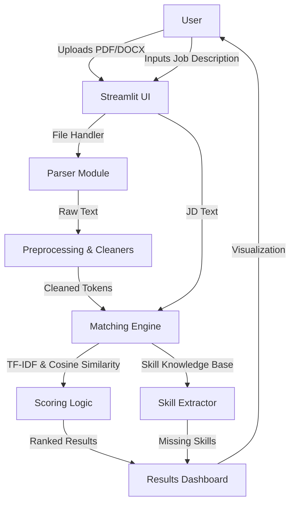

# Smart AI Resume Analyzer - Project Report

## 1. System Architecture

The system follows a modular architecture separating data ingestion, processing, and presentation layers.



## 2. Process Flowchart

```mermaid
flowchart TD
    A[Start] --> B{Upload Resume?}
    B -- Yes --> C[Extract Text (PDF/DOCX)]
    B -- No --> B
    
    C --> D[Clean Text]
    D --> E[Tokenize & Lemmatize]
    D --> F[Extract Skills (NER + Keywords)]
    
    G[Input Job Description] --> H[Preprocess JD]
    H --> I[Vectorize (TF-IDF)]
    E --> I
    
    I --> J[Calculate Cosine Similarity]
    J --> K[Rank Candidates]
    K --> L[Identify Missing Skills]
    L --> M[Display Results & Graphs]
    M --> N[End]
```

## 3. Dataset Format and Information

Since this is a real-time analyzer, it does not rely on a pre-trained `csv` dataset for training a model (unsupervised approach). However, for testing, you can use resumes in the following format:
- **Format**: PDF or DOCX
- **Content**: Standard resume sections (Education, Skills, Experience).
- **Job Description**: Plain text describing the role.

## 4. Research Explanation

### Why TF-IDF and Cosine Similarity?
- **Efficiency**: TF-IDF (Term Frequency - Inverse Document Frequency) is computationally efficient and works excellent for keyword-heavy documents like resumes.
- **Explainability**: Unlike opaque deep learning vectors (like BERT), TF-IDF mappings can explicitly show which terms contributed to the score, which is crucial for HR transparency.
- **Cosine Similarity**: Measures the angle between two vectors, effectively capturing how "aligned" the resume content is with the JD in the N-dimensional vocabulary space, regardless of length.

### Why spaCy?
- **Performance**: spaCy is industry-standard for speed and accuracy in NER (Named Entity Recognition).
- **Linguistic Power**: Its lemmatizer handles verb forms (e.g., "managing" -> "manage") better than simple stemmers, ensuring better matching.

## 5. Sample Output
**Candidate**: John Doe
**Score**: 85.5%
**Status**: ✅ Highly Recommended
**Missing Skills**: Docker, Kubernetes

### Future Improvements
- **Semantic Search**: Use Sentence-BERT (SBERT) for understanding context (e.g., "backend dev" ~ "server-side engineer").
- **OCR**: Integrate Tesseract for image-based PDFs.
